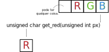

# Lab 7 - Manipulando bits

!!! note
    Esse lab. considera o GCC como compilador.

Na linguagem `C` a menor unidade de armazenamento existente é a do `char`, que possui 8 bits. Mesmo sendo considerada de 'baixo nível' não possuímos uma maneira 'built-in' na linguagem de armazenar e/ou processar um único `bit`. Alguns compiladores para sistemas embarcados fornecem um tipo bit, porém isso é exclusivo dessas plataformas.

!!! note
    No ARM possuímos os seguintes tipos definidos:
    
    | type              | Size in bits | natural alignment in bytes |
    | ------------      | ------------ | -------------------------- |
    | char              |            8 | 1   (byte-aligned)         |
    | short             |           16 | 2   (halfword-aligned)     |
    | int               |           32 | 4   (word-aligned)         |
    | long              |           32 | 4   (word-aligned)         |
    | long long         |           64 | 8   (doubleword-aligned)   |
    | float             |           32 | 4   (word-aligned)         |
    | double            |           64 | 8   (doubleword-aligned)   |
    | long double       |           64 | 8   (doubleword-aligned)   |
    | All pointers      |           32 | 4   (word-aligned)         |
    | _Bool (C only[a]) |            8 | 1   (byte-aligned)         |
     
    [a] **stdbool.h can be used to define the bool macro in C**.
    
    > fonte: http://infocenter.arm.com/help/index.jsp?topic=/com.arm.doc.dui0491c/Babfcgfc.html

A manipulação de bits é muito importante quando utilizamos a linguagem para: interagir com o hardware; verificar e manipular tipos; otimizações. Por exemplo, imagine uma função que recebe um `unsigned int` que possui um pixel codificado no formato `RGB` (8 bits de Vermelho (R), 8 bits de Verde (G) e 8 bits de Azul (B)) e deseja retornar um `unsigned char` (8 bits) que possui apenas o valor correspondente da cor Verde.


```c
unsigned char get_green(unsigned int px)
```

Conforme demonstrado na figura a seguir:

{width=500}

Como realizar isso em C? O segredo será manipular os bits de entrada deslocandoos para direita 16 bits:

{width=400}

No deslocamento (`shift`) os bits que 'saem' são descartados e os que 'entram' para formar a nova palavrão são sempre `0`. No exemplo anterior estamos visualizando o deslocamento de blocos de 8 bits, porém em C só conseguimos mover blocos de `1 bit`. Para isso, iremos usar o operador `>>` que possui a esquerda a palavra que será deslocada e a direita a quantidade de bits que serão movidos. 

Utilizando o conceito de shift, a função `get_red` possui a seguinte implementação:

```c
unsigned char get_green(unsigned int px){
    return(px >> 16);
}
```

> Para evitar warnings de type cast seria necessário usar: `return((unsigned char) (px >> 16))`, mas optamos pode deixar o exemplo na forma mais simples.`

## Operadores binário (Bitwise)

Em C possuímos os seguintes operadores binários:

!!! note ""
     Considerar para os exemplos a seguir:
    
     - A = `0011 1100`
     - B = `0000 1101` 

| Operador | Descrição                                               | Exemplo                           |
|----------|---------------------------------------------------------|-----------------------------------|
| `&`      | Realiza a operação `AND` bit a bit                      | `A & B` :arrow_right: `0000 1100` |
| `|`        | Realiza a operação `OR` bit a bit                        | `A | B` :arrow_right: `0011 1101`      |
